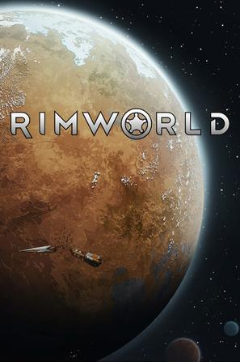
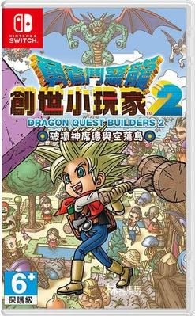

我相信遗忘, ftl的东西我几乎已经忘记了......frostpunk我还记得, 那些最好的, 记住的东西

1. FTL GDC talk 
   > 他们创作的过程是一个模拟游戏好的设计过程, 也让我看到一个好的机制设计师是什么样子, 和他们相比较，我就知道自己不是一个好的机制设计师.

2. 将游戏设计视为探索而非工作 - jonas tyroller 
   > fun, attractive, scope 游戏开发的几个关键评估标准
   >
   > 我认为深海探索的概念, 玩法原型和艺术原型区分开来的想法非常棒, 让我们可以专注在一个方面, 不被打断, 不必背负舍弃的负担
   >
   > 船长的想法也很棒, 是团队分工合作中的一环

3. 边缘世界 RimWorld 
   
   > 学! 故事模拟器!

4. 超越光速 FTL: Faster Than Light 
   

   > 学! 策略设计!

5. 勇者斗恶龙：创世小玩家2 破坏神席德与空荡岛 ドラゴンクエストビルダーズ2 破壊神シドーとからっぽの島 
   
   > 从好玩移动而来, 因为我很少想起他. 生活模拟, 如果是多人, 会更好玩

6. 勇者斗恶龙7 重制版 ドラゴンクエストVII Reimagined 
   
   > 画面很好,ui很好,手感很好, 故事也有点睛之笔, 在许多年前应该是一个好的作品，但是在今天这个讲故事的方式显得拖沓，不和谐!
